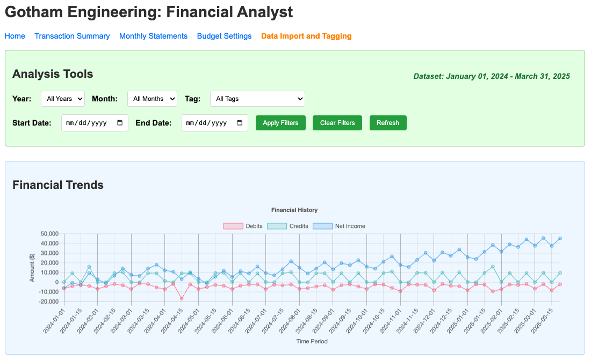
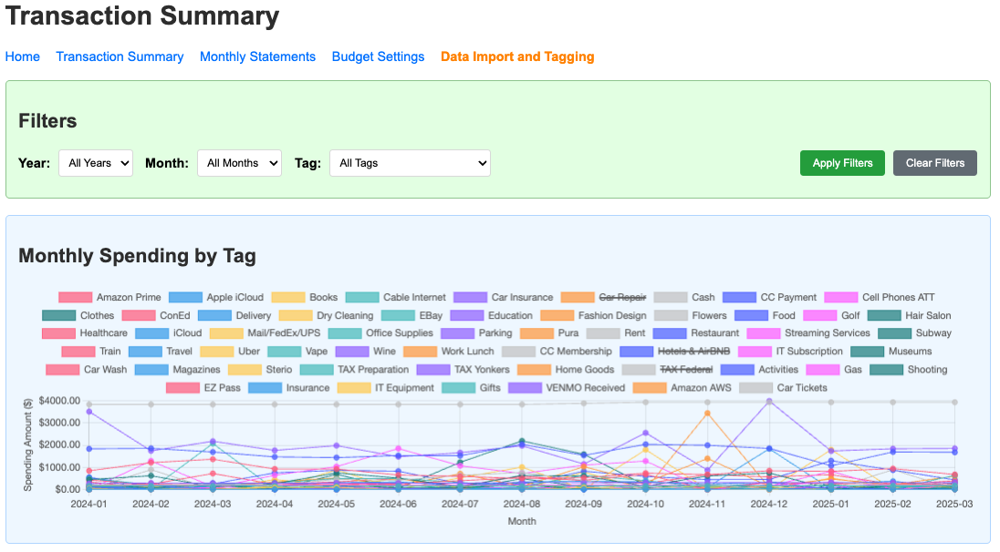

# Gotham Engineering: Financial Analyst (Beta)

This is the Beta version of the Financial Analyst application, building upon the successful Alpha version (previously known as "spending_db"). The Financial Analyst application helps you track, analyze, and visualize your financial data.



## Features

### Core Features (from Alpha)
- Import transactions from on-line Banking and Credit Card statements in CSV format
- Tag transactions for categorization
- Historical transaction analysis
- Monthly spending statements
- Transaction summaries by tag
- Financial trend visualization

### New Features (Beta)
- Budget setting & tracking
- Enhanced interactive visualizations
- Recurring transaction detection
- Financial forecasting
- Tag hierarchies/categories
- Custom time period reports
- Advanced auto-tagging rules
- Enhanced export options
- Income vs. expense separation
- Net worth tracking



## Getting Started

### Prerequisites
- Docker
- Docker Compose

### Installation and Use

1. Clone the repository:
```bash
git clone https://github.com/fiberoptix/ai-coding-sandbox.git
cd ai-coding-sandbox/financial_analyst
```

2. Start the application:
```bash
./run-docker.sh start
```

3. Rebuild the application (if needed):
```bash
./run-docker.sh rebuild
```

4. Access the application at: http://localhost:5002

## Usage

1. Import your financial data using the "Import New Records" function
2. Tag your transactions to categorize them
3. Analyze your spending patterns in the various views
4. Create budgets and track your financial goals
5. View forecasts of future spending based on historical data

## Database Structure

The application uses PostgreSQL with the following main tables:
- `records_imported`: Raw transaction data
- `tags`: Tag definitions for transaction categories
- `records_history`: Historical transaction records
- (Additional tables for new beta features)

## Development

To contribute to the development of Financial Analyst:

1. Fork the repository
2. Create a feature branch: `git checkout -b new-feature`
3. Commit your changes: `git commit -am 'Add new feature'`
4. Push to the branch: `git push origin new-feature`
5. Submit a pull request 